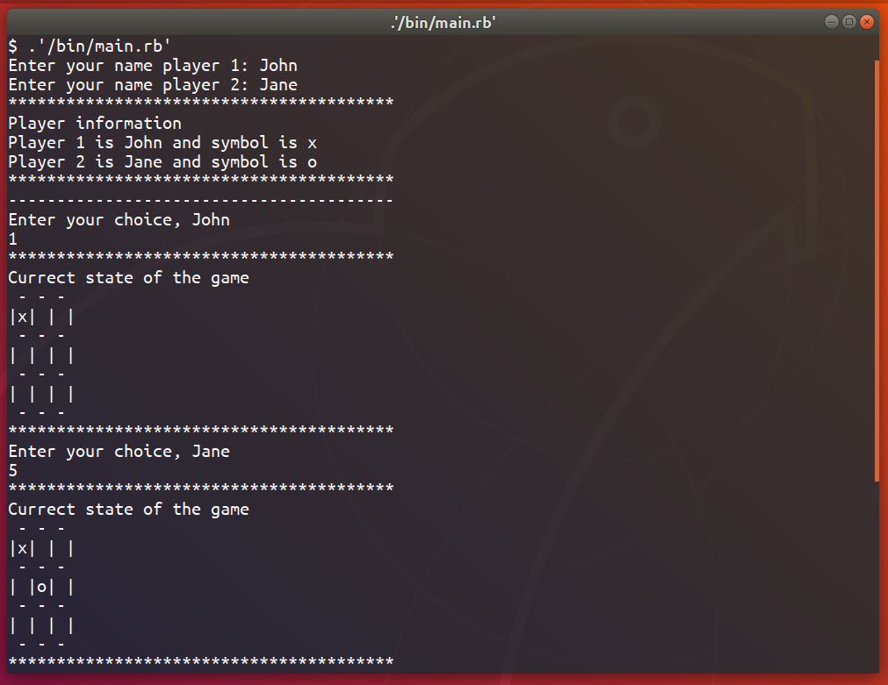

# TIC-TAC-TOE

> This an implementation of tic tac toe in ruby using the object oriented approach

## Built With

- Ruby
- Visual Studio Code, Atom

## Live Demo

[Live Demo Link](https://livedemo.com)

## Getting Started

To get a local copy up and running follow these simple example steps.
- Clone all the files and branches onto your local machine

### Prerequisites

- Ruby should be installed
- A terminal should be installed

### How to Play

- To get started execute the ruby file: 'bin/main.rb'
- Enter both players names'
- Each player makes his/her move until either one wins or it's a draw
- One can win if he/she matches either horizontally, vertically or diagonally

## Authors

👤 **Nick**

- GitHub: [@Nkuria](https://github.com/Nkuria)
- LinkedIn: [Nick Kuria](https://www.linkedin.com/in/nick-kuria-a148931a9/)

👤 **Alaukik**

- Github: [@newhorizon-tech](https://github.com/newhorizon-tech)
- Twitter: [@techintosh3](https://twitter.com/techintosh3)

## 🤝 Contributing

Contributions, issues, and feature requests are welcome!

Feel free to check the [issues page](https://github.com/newhorizon-tech/tic-tac-toe/issues).

## Show your support

Give a ⭐️ if you like this project!
